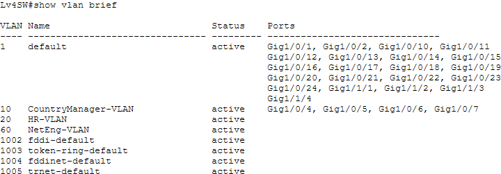
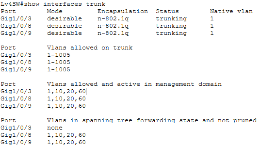

## Write your cmds / docs here if you want

So like 2 isp router
2 core switch
4 access
2 router and 6 switches, I just made like the base thingy

to do:
configure both core in server room to use Etherchannel to every other switch
https://xsite.singaporetech.edu.sg/d2l/le/enhancedSequenceViewer/189269?url=https%3A%2F%2Feb7d8702-81cc-4acd-8156-b72a5f076aca.sequences.api.brightspace.com%2F189269%2Factivity%2F907043%3FfilterOnDatesAndDepth%3D1

layer 3 to layer 3 channel between both core
https://xsite.singaporetech.edu.sg/d2l/le/enhancedSequenceViewer/189269?url=https%3A%2F%2Feb7d8702-81cc-4acd-8156-b72a5f076aca.sequences.api.brightspace.com%2F189269%2Factivity%2F903648%3FfilterOnDatesAndDepth%3D1

RSTP for both core switches
https://xsite.singaporetech.edu.sg/d2l/le/enhancedSequenceViewer/189269?url=https%3A%2F%2Feb7d8702-81cc-4acd-8156-b72a5f076aca.sequences.api.brightspace.com%2F189269%2Factivity%2F903649%3FfilterOnDatesAndDepth%3D1

create all switches in a trunk -> configure hsrp
https://xsite.singaporetech.edu.sg/d2l/le/enhancedSequenceViewer/189269?url=https%3A%2F%2Feb7d8702-81cc-4acd-8156-b72a5f076aca.sequences.api.brightspace.com%2F189269%2Factivity%2F903650%3FfilterOnDatesAndDepth%3D1

assign ip address for all devices

assign vlans where needed
country office vlan 10
marketiong vlan 20
networking dept vlan 30 -> should it access other vlans?
Service dept vlan 40
software dept vlan 50 -> Should it be allowed to access server?

make trunking and vlans accordingly
https://xsite.singaporetech.edu.sg/d2l/le/enhancedSequenceViewer/189269?url=https%3A%2F%2Feb7d8702-81tcc-4acd-8156-b72a5f076aca.sequences.api.brightspace.com%2F189269%2Factivity%2F903650%3FfilterOnDatesAndDepth%3D1

inter-vlan routing for isp routers
https://xsite.singaporetech.edu.sg/d2l/le/enhancedSequenceViewer/189269?url=https%3A%2F%2Feb7d8702-81cc-4acd-8156-b72a5f076aca.sequences.api.brightspace.com%2F189269%2Factivity%2F897107%3FfilterOnDatesAndDepth%3D1

commands run (Ryan)
dist switch 
   set up all vlans
      ip add XXXX
      no shut
   set up etherchannels (PAGP)
      int XXX
      channel-group Y mode auto
      no shut

      int poY 
      switchport mode trunk
      switchport trunk allowed vlan A,B,C
   stp
      spanning-tree vlan 10,20,30,40,50,60,70 root primary/secondary

access switch
   setup etherchannels
      int XXX
      channel-group Y mode desirable
      no shut

      int poY 
      switchport mode trunk
      switchport trunk allowed vlan A,B,C

   stp
      spanning-tree vlan 10,20,30,40,50,60,70 priority 61440

ISP 1 g0/0 ISP 2 g0/0

r2 f0/0/1 f0/0/0 r1
r2(165) f0/0/0 f0/1 cs2(166)
r2(161) g0/1 f0/2 cs1(162)
cs2(157) f0/3/0 f0/2 r1(158)
cs1(154) f0/1 g0/1 r1(153)

Switch all vlan 99

level 4
**Changes Made (Alan):**

- Changed switch host name to "Lv4SW"
- VLAN 20 named to HR-VLAN
- VLAN 10 named to CountryManager-VLAN
- VLAN 60 named to NetEng-VLAN

**Commands done for switchport access: (VLAN 10)**

- switchport mode access
- swichport access vlan [ number ]

**Commands done for switchport trunking: (VLAN 20/VLAN 60)**

- switchport mode trunk
- switchport mode dynamic desirable

**Configured VLAN 10 for following interfaces:**

- G1/0/4
- G1/0/5
- G1/0/6
- G1/0/7

**Configured VLAN 20 for following interfaces:**

- G1/0/8
- G1/0/9

**Configured VLAN 60 for following interfaces:**

- G1/0/3

hr ex g1/0/9 v20 172.16.1.211/28
hr m g1/0/8 v20 172.16.1.212/28
dy cm g1/0/7 v10 172.16.1.3/26
s1 g1/0/6 v10 172.16.1.4/26
s2 g1/0/5 v10 172.16.1.5/26
cm g1/0/4 v10 172.16.1.6/26
net eng g1/0/3 v60 172.16.1.134/28

172.16.1.243
cs (meeting room) po4 g1/0/1 f0/4 cs1 po1
cs (meeting room) po4 g1/0/13 f0/8 cs1 po1
cs (meeting room) po4 g1/0/14 f0/9 cs2 po2
cs (meeting room) po4 g1/0/2 f0/3 cs2 po2

vlans 10,20,60

level 2
net eng f0/22 v60 172.16.1.133/28 D
hr ex f0/21 v20 172.16.1.213/28 D
sm f0/9 v30 172.16.1.68/26 D
dy sm f0/8 v30 172.16.1.79/26 D
se1 f0/10 v30 172.16.1.70/26 D
se2 f0/7 v30 172.16.1.71/26 D
se3 f0/6 v30 172.16.1.72/26 D
se4 f0/5 v30 172.16.1.73/26 D
se5 f0/4 v30 172.16.1.74/26 D
se6 f0/3 v30 172.16.1.75/26 D
se7 f0/2 v30 172.16.1.76/26 D
se8 f0/1 v30 172.16.1.77/26 D
172.16.1.245
allow vlan 20 30 60

Dist  X Y L2A 
po2 1 5 11 po1 LACP
po2 1 10 16 po1 LACP
po2 2 11 17 po2 
po2 2 4 12 po2

level 3
sol m f0/10 v50 172.16.1.227/28 D
s sol d1 f0/9 v50 172.16.1.228/28 D
s sol d2 f0/8 v50 172.16.1.229/28 D
net m f0/7 v60 172.16.1.131/28 D
net e f0/6 v60 172.16.1.132/28 D
s net eng f0/5 v60 172.16.1.136/28 D
hr ex f0/4 v20 172.16.1.214/28 D
web server f0/3 v70 172.16.1.195/29 D
dns cache f0/2 v70 172.16.1.196/29 D
dns server f0/1 v70 172.16.1.197/29 D
172.16.1.244
po1 l3s f0/11 f0/3 cs1 po3
p01 l3s f0/16 f0/9 cs1 po3
po2 l3s f0/12 f0/6 cs2 po3
po2 l3s f0/17 f0/12 cs2 po3
vlan 20 50 60 70

level 1
172.16.1.246
l1s f0/16 f0/5 cs2
l1s f0/21 f0/10 cs2
l1s f0/15 f0/6 cs1
l1s f0/20 f0/11 cs1

vlan 20 40 60

ser m f0/9 v40 172.16.1.179/27
dy ser m f0/8 v40 172.16.1.180/27
hr ex f0/14 v20 172.16.1.215/28
net eng f0/13 v60 172.16.1.135/28
ser ex1 f0/10 v40 172.16.1.181/27
ser ex2 f0/7 v40 172.16.1.182/27
ser ex3 f0/6 v40 172.16.1.183/27
ser ex4 f0/5 v40 172.16.1.184/27
ser ex5 f0/4 v40 172.16.1.185/27
ser ex6 f0/3 v40 172.16.1.186/27
ser ex7 f0/2 v40 172.16.1.187/27
ser ex8 f0/1 v40 172.16.1.188/27
ser ex9 f0/11 v40 172.16.1.189/27
ser ex10 f0/12 v40 172.16.1.190/27

1. Point-to-Point routed links (keep your given IPs)
   Link Subnet Side A IP Side B IP
   R1 ↔ CS1 172.16.1.152/30 R1 172.16.1.153 CS1 172.16.1.154
   R1 ↔ CS2 172.16.1.156/30 CS2 172.16.1.157 R1 172.16.1.158
   R2 ↔ CS1 172.16.1.160/30 R2 172.16.1.161 CS1 172.16.1.162
   R2 ↔ CS2 172.16.1.164/30 R2 172.16.1.165 CS2 172.16.1.166

ISP links (you didn’t give IPs, so allocate next clean /30s):

ISP1 ↔ R2 g0/0 : 172.16.1.168/30 (R2=172.16.1.169, ISP1=172.16.1.170)

ISP2 ↔ R1 g0/0 : 172.16.1.172/30 (R1=172.16.1.173, ISP2=172.16.1.174)

VLAN Purpose Subnet Usable hosts
10 DY / S1 / S2 / CM 172.16.1.0/26 62 vlan:172.16.1.1 172.16.1.2
20 HR 172.16.1.208/28 14 vlan:172.16.1.209 172.16.1.210
30 SE / SM group 172.16.1.64/26 62 vlan:172.16.1.65 172.16.1.66
40 Service VLAN 172.16.1.176/28 vlan:172.16.1.177 172.16.1.178
50 SOL + related 172.16.1.224/28 14 vlan: 172.16.1.225 172.16.1.226 fuckkkkkk
60 Net Eng 172.16.1.128/28 14 vlan:172.16.1.129/28 172.16.1.130/28
70 DNS/Web servers 172.16.1.192/29 6 vlan:172.16.1.193 172.16.1.194  

(reserved) routed links + ISPs 172.16.1.152–175 (your P2P + ISP)

99 Switch mgmt + native 172.16.1.240/28 14

----------------------------------------------------------------------
I abandoned the mesh design because

1️⃣ STP behavior (this alone is a huge win)
First design (mesh-heavy)

Many Layer-2 paths

STP must block lots of links

Small config mistake → broadcast storm

Root changes can ripple everywhere

Debugging is painful (“why is this link blocked?”)

Second design (clean access → dist)

Clear STP root (Dist1 primary, Dist2 secondary)

Only one loop per access block

Blocked ports are expected

Failure behavior is deterministic

Benefit:
You can predict which link forwards and which blocks.

2️⃣ Failure domains (blast radius)
First design

One bad trunk can affect multiple departments

STP reconvergence touches large parts of the network

A loop can melt the whole LAN

Second design

Each access switch is its own failure domain

Problems stay local

Dist layer absorbs failures cleanly

Benefit:
When something breaks, fewer people are affected.

3️⃣ Operational complexity (day-2 reality)
First design

You must manage:

STP tuning everywhere

VLAN pruning on many links

Port-channel consistency

Cross-switch dependencies

Second design

You manage:

Standard trunk templates

HSRP/VRRP once per VLAN

STP root in one place

Benefit:
Easier changes, fewer outages, junior engineers won’t kill it accidentally.

4️⃣ Redundancy that actually matters
First design

Many links exist…

…but STP blocks most of them

Extra cables give illusion of resilience

Second design

One active + one standby uplink per access switch

Failover is fast and intentional

Redundancy is real, not cosmetic

Benefit:
Redundancy that works the way you expect.

5️⃣ Scalability
First design

Adding a new access switch:

Multiple trunks

VLAN propagation concerns

STP recalculation risk

Second design

Add access switch:

2 uplinks

Done

Benefit:
Network grows linearly instead of exponentially in complexity.

6️⃣ Security & segmentation
First design

VLANs stretch everywhere

Easier lateral movement

Harder to contain misconfigs

Second design

VLANs terminate at distribution

ACLs / policies centralized

Easier to implement Zero Trust later

Benefit:
Much safer foundation.

7️⃣ Performance (counter-intuitive but true)
First design

More links ≠ more bandwidth

STP blocks many paths

Traffic hairpins unpredictably

Second design

Known traffic paths

No surprise blackholes

Easier QoS and monitoring

Benefit:
Performance you can reason about.

8️⃣ Real-world credibility (important for exams & interviews)

If you showed both diagrams to a senior network engineer:

First diagram →
“Why is this so complicated? What problem are you solving?”

Second diagram →
“Yep. Standard collapsed core. Sensible.”

Benefit:
Second design aligns with Cisco validated designs, exams, and industry norms.
